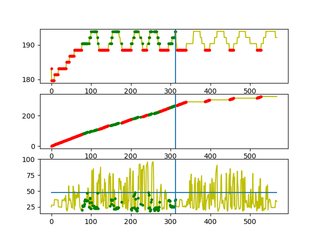

# Coolant Temperature
It compares the value of coolant temperature with that of the predefined
values of coolant temperature to check whether the system is running in the safe state or not.

## Flow Chart

 ## Input
 
-   Engine Coolant Temperature(°C)
-   Engine Load(%)
-   Trip Time(Since journey start)(s)

## Output

-   Graph of Coolant temperature vs Index showing where the temperature has excedded.
-   Graph Engine load vs Trip time.

## Coverage

