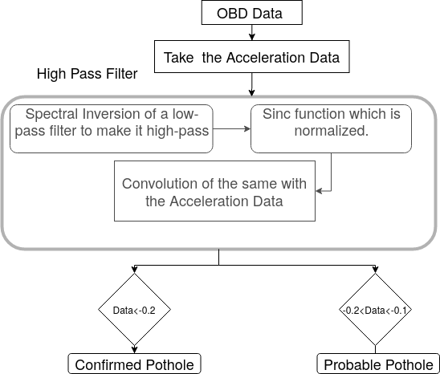

# Road Profile
The function detects potholes on roads according to accelerometer readings in the vertical acceleration directions.

## Flowchart

## Inputs
- Accelerometer readings (According to the orientation of the smartphone: X-Direction in this case)

## Output
- Graph indicating all the values exceeding a threshold of -0.2 confirmed as potholes. (Acceleration vs Time)

## Coverage link 
[Link](https://raw.githack.com/prithvisekhar/VehicalDiagnosticAlgo/gh-pages/Function/DIARoadProfile/htmlcov/index.html)
