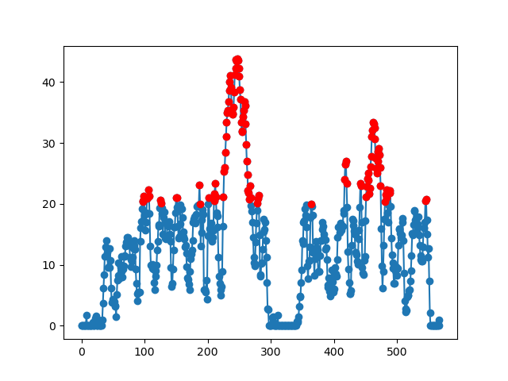

# Speed Violation
It checks the speed of the system and returns the location at which the speed
of the system exceeded the permissible value.

## Flow Chart

## Input

-   Latitude

-   Longitude

-   Speed (GPS)(km/h)

-   Speed Limit

## Output
 
-   Graph showing the instances where the speed limit is voilated.

## Coverage
For Coverage follow this [link](https://raw.githack.com/prithvisekhar/VehicalDiagnosticAlgo/gh-pages/Function/DIASpeedVoilation_SpeedVoilation/htmlcov/index.html)
