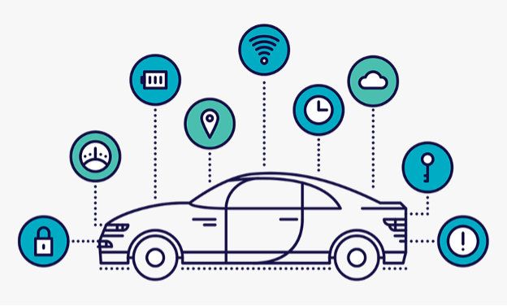
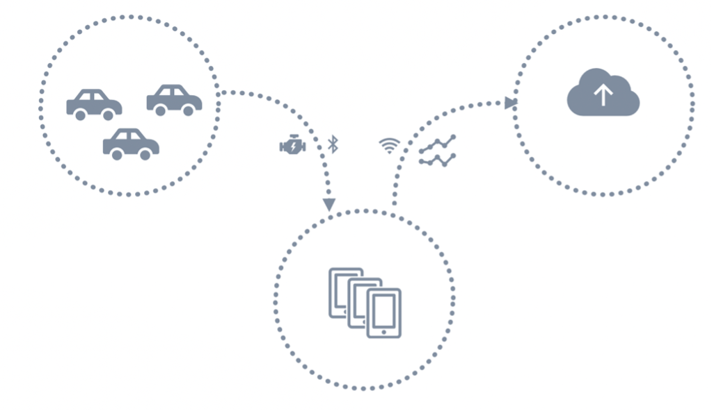
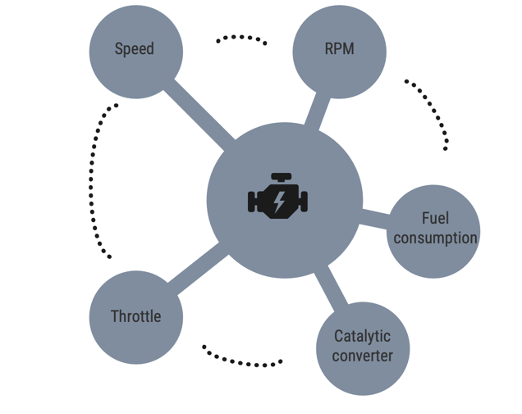
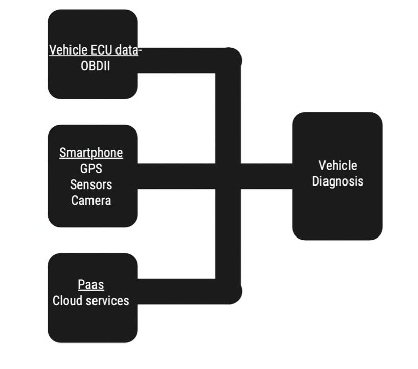
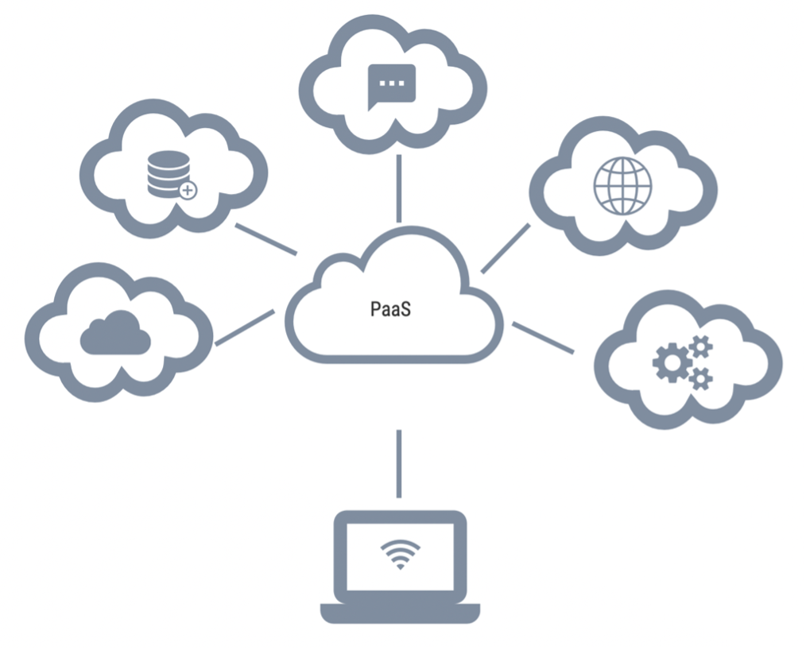
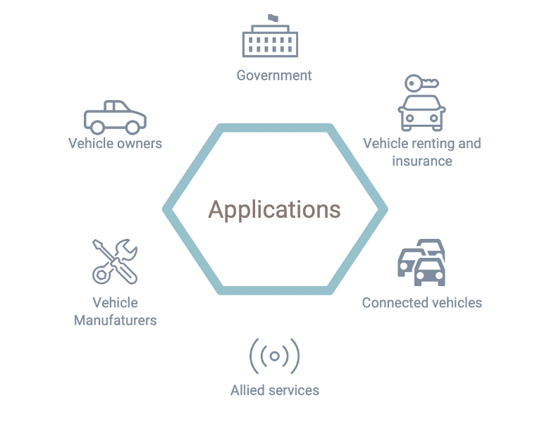
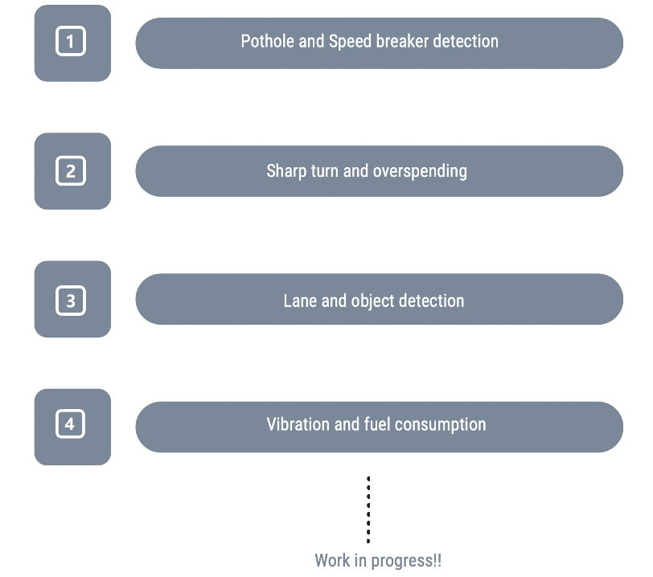

## Status

 

#### Website of the Project - [Link](https://prithvisekhar.github.io/VehicalDiagnosticAlgo/)

Heterogenous driving behavior is observed in many countries that affect the quality of traffic and infrastructure maintenance. Issues such as traffic congestion, obstacles by pedestrians, road choke points are mainly caused by transport infrastructure related problems.

On the other hand, aggressive driving styles and behavior impact road safety as well as vehicle health. Increased fuel consumption, over-speeding, optimum gear shifting, vehicle vibrations etc., can be monitored and regulated accordingly to improve vehicle health. As the complexity of vehicles have increased over the years, the automotive industry has now moved towards automated vehicle data analysis.

The ECU (Engine Control Unit) of a vehicle can be accessed through numerous diagnostics protocols. The task is made simpler with the introduction of diagnostic protocols such as OBD-II and UDS. 

The data obtained from the OBD-II is combined with the GPS data and time stamps and can be recorded through a third-party application. As these data points will be accessed through a smartphone, data from smartphone sensors such as accelerometer, gyroscope and magnetometer are also available. 

The smartphone integration can be more powerful with the inclusion of the camera element. The addition of the visual perspective gives rise to a wide range of applications that extend beyond vehicle diagnostics and can be implemented in vehicles seamlessly. 

The combination of the OBD-II module and the smartphone integration is the most cost-effective solution compared to other diagnostics and prognosis tools available in the automotive market. 

Component 1 – Vehicle ECU data: In recent years, efforts have been concentrated towards acquiring vehicle ECU data for various purposes like monitoring vehicle health and controlling air pollutants from vehicles. Although there are several OBD modules available in the market at present, the OBD-II ELM327 has gained popularity as data can be accessed by the means of Bluetooth or Wi-Fi protocols. 

Component 2 – Smartphone: With technical advancements all over the world, smartphones in the present scenario have become extremely powerful devices. With multiple in-built sensors present in the hardware, smartphone applications have been developed for driver behavior monitoring and other diagnostics purposes. As smartphones are equipped good quality cameras, the system would also exploit video data. 

Component 3 – Cloud:  Cloud platforms such as AWS DynamoDB are multiregional with built-in security and can provide fast access to data for globally distributed applications. Additionally, Cloud based services can handle terabytes of data seamlessly without minimizing the performance of the application. The role of cloud-based PaaS would enhance the scalability and maintenance of the system. 

Cost effective and reliable cloud-based data analytics systems have been a popular choice for crowd sourcing applications. Applications that are created locally can be deployed on the cloud using PaaS (Platform as a service) securely. 

Cloud services such as PaaS (Platform as a service) provides users with a shared cloud platform for personalised application development and management without the burden of maintenance of the infrastructure.

The most important component of PaaS is the Application Runtime Environment (ARE) [4] that fulfills basic requirements such as security and scalability. The advantage of the ARE is that it offers multi-tenancy architecture where multiple users can share instances simultaneously onto the cloud. This feature is a major advantage in the case of vehicle diagnosis and prognosis as data from multiple users need to be handled in an efficient manner. 

Vehicle manufacturers: Performance of vehicles in different geographical locations can be analysed. Vehicle models can be compared based on their performance in different road conditions. 

The Government:  Infrastructure can be managed efficiently with the data obtained from multiple devices. Road anomalies and other abnormalities can be reported through the cloud services. 

Incident analysis: Road accidents and other dangerous situations can be assessed with the help of OBD-II and Camera data. Alerts and traffic-based updates can be shared using the concept of connected vehicles. 

Traffic Violations: The traffic department majorly benefits from this feature as traffic violations can be recorded and reported using the system proposed. This would automate the process of bills and fines as data is obtained from multiple angles and sources. 
Vehicle owners: The system does not require any additional hardware other than the OBD-II module and a smartphone. Hence making it easier for owners to deploy the system without further assistance. Understanding servicing cycles and vehicle maintenance can be simplified with the described implementation. Factors such as fuel consumption and vehicle emissions can be monitored. 

Vehicle renting and insurance agencies: Driving behaviour and styles can be monitored to create driving scores. Vehicles can be rented on the basis on these scores to avoid vehicle damage. Insurance companies can analyse the condition of vehicles and can make use of the incident analysis feature to analyse the damage caused. 

Occupant safety and allied services: Occupant health analysis can be useful to understand their response to various driving styles. These can be based on visual or physiological sensing methods. Advanced object and human activity detection can be introduced to enhance safety of infants or elderly in vehicular environments. 

Features implemented:

